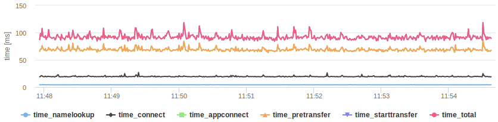

# Website performance monitoring with curl

A self-hosted solution for monitoring and visualizing response time metrics of websites.

## Usage

1. Supply the URLs you want to monitor in `urls.txt`, one URL per line.
2. Execute `check.sh` to collect response time metrics. Metrics are written in directory `csv_metrics`. Execute via cron for continuous monitoring.
3. Execute `generate_reports.sh` to build HTML reports with visualizations powered by Highcharts. Reports are written in directory `html_reports`. Execute via cron for regular updates.

## How it works

`check.sh` simply executes `curl` with a custom write-out format for every given URL. The format is defined in `curl_format.txt` and produces a line of semicolon-separated CSV. The line is appended to a CSV file in directory `csv_metrics`. For every monitored URL one CSV file is produced.

`generate_reports.sh` takes every produced CSV files from directory `csv_metrics` and creates a corresponding report file in directory `html_reports`. In order to generate the report, the file `report_template.html` is copied and the CSV data pasted in. The HTML template uses the Highcharts library and its data module to display a line graph of collected metrics.